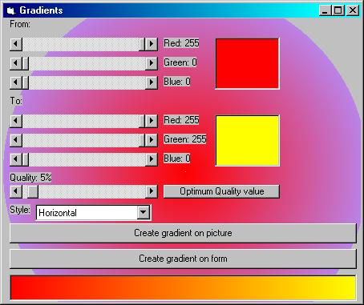



## Gradient module and sample code

### Description

Yes! A module that creates gradients! This BAS file will seperate a color into red, green, and blue with one sub, then create a gradient in another. This BAS allows horizontal, vertical, or circular gradients to be created for your VB projects easily! It also has a quality feature, if your gradient is particularly large. This BAS can write to any control that can be drawn on. No API! UPDATED!!! This code can now create a gradient in ANY SHAPE OR SIZE!!!!!!!!!!!! Also added in the update: Common Dialog boxes for color picking, click the from and to boxes showing the sample color to get a common dialog for the appropriate one. Also new, is the feature to save your gradient as a bitmap file!
 
### More Info
 
The sub CreateGradient returns a gradient image on the chosen canvas(Control). The sub SeperateColors takes a control's background color and splits it into Red, Green, And Blue components

             |
---                |---
**Submitted On**   |2000-02-27 14:44:12
**By**             |[Michael Barnathan](https://github.com/Planet-Source-Code/PSCIndex/blob/master/ByAuthor/michael-barnathan.md)
**Level**          |Intermediate
**User Rating**    |5.0 (15 globes from 3 users)
**Compatibility**  |VB 4\.0 \(16\-bit\), VB 4\.0 \(32\-bit\), VB 5\.0, VB 6\.0
**Category**       |[Custom Controls/ Forms/  Menus](https://github.com/Planet-Source-Code/PSCIndex/blob/master/ByCategory/custom-controls-forms-menus__1-4.md)
**World**          |[Visual Basic](https://github.com/Planet-Source-Code/PSCIndex/blob/master/ByWorld/visual-basic.md)
**Archive File**   |[CODE\_UPLOAD36592272000\.zip](https://github.com/Planet-Source-Code/michael-barnathan-gradient-module-and-sample-code__1-6301/archive/master.zip)

